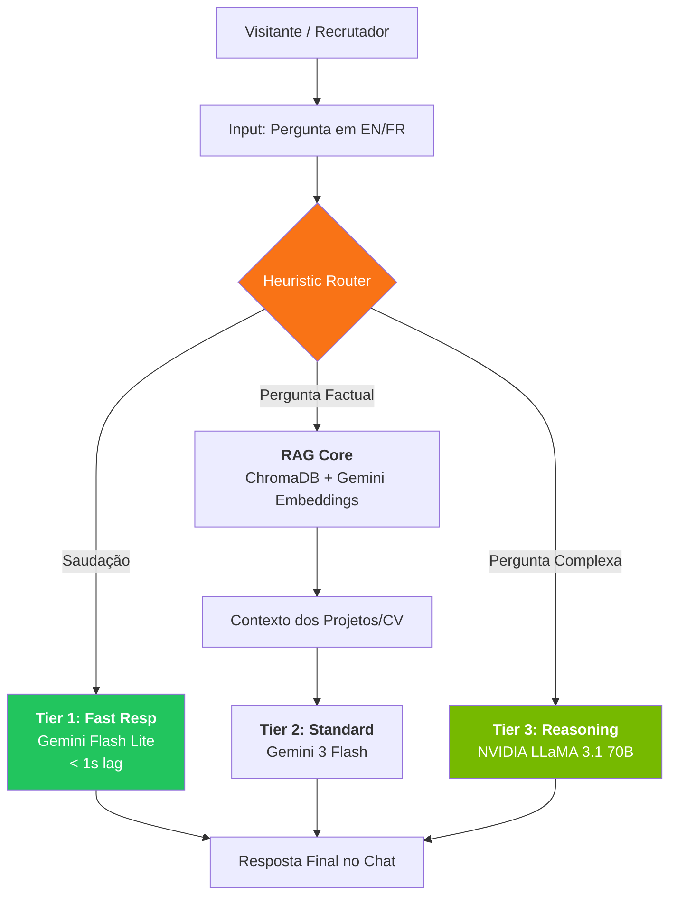

# Midolli-AI — RAG Chatbot for Data Portfolio

🇫🇷 [Version française ci-dessous](#-midolli-ai--chatbot-rag-pour-portfolio-data)

## 🇬🇧 What is Midolli-AI?

Midolli-AI is an advanced **RAG (Retrieval-Augmented Generation)** chatbot specifically engineered to serve as an interactive AI representative for [Rafael Midolli's Senior Data Portfolio](https://r-midolli.github.io/portfolio_rafael_midolli/). It doesn't just "chat"; it acts as a deep-knowledge engine capable of answering technical, professional, and personal questions about Rafael's career in **English or French**, cross-referencing real-time data from his projects, CV, and specialized knowledge files.

### 🚀 Key Technical Features (2026 Stack)

1.  **3-Tier Intelligent Routing (New!):** To achieve the best trade-off between speed and intelligence, the backend classifies every query into one of three complexity tiers:
    *   🟢 **Greeting/Simple (Tier 1):** Uses `gemini-flash-lite-latest`. Skips the heavy RAG retrieval process for greetings ("Hi", "Oi", "Bonjour") to respond in **~1 second**.
    *   🔵 **Normal (Tier 2):** Uses `gemini-3-flash-preview`. Standard RAG retrieval for specific questions about skills or single projects.
    *   🔴 **Complex/Analytical (Tier 3):** Uses `meta/llama-3.1-70b-instruct` (NVIDIA Build). Triggered for long questions, deep project analysis, or long conversation histories.
2.  **Super-RAG Architecture:** The ingestion engine (`ingest.py`) doesn't just read summaries. It crawls the **actual source code READMEs** of all 5+ major projects in Rafael's workspace, extracts text from his **2026 PDF CV**, and ingests a multifaceted "Personal Knowledge Base" (FAQ, Bio, MBA details).
3.  **Performance Tracking:** Every response from the AI now includes a discrete "⚡ Responded in X.Xs" timer, providing transparency on the system's optimization.
4.  **Triple API Redundancy:** Automatic fallback system (Google Key 1 → Google Key 2 → NVIDIA) ensuring 99.9% uptime even during provider outages.

### 🧠 System Architecture

### 📂 Repository Structure

*   `backend/chain.py`: The "brain" — contains the routing logic, RAG pipeline, and API integrations.
*   `backend/ingest.py`: The data engine — automated chunking, embedding, and vectorization into ChromaDB.
*   `backend/knowledge/`: Source of truth — Markdown files containing Rafael's detailed professional background.
*   `frontend/`: The UI components — a high-performance Vanilla JS widget designed for zero friction on any webpage.
*   `scripts/evaluate_rag.py`: The QA layer — uses LLM-as-a-Judge to measure accuracy against a ground-truth dataset.

---

## 🇫🇷 Midolli-AI — Chatbot RAG pour Portfolio Data

Midolli-AI est un chatbot **RAG (Retrieval-Augmented Generation)** de pointe, conçu pour être le représentant IA interactif du [Portfolio Data de Rafael Midolli](https://r-midolli.github.io/portfolio_rafael_midolli/). Plus qu'un simple outil de chat, c'est un moteur de connaissance capable de répondre à des questions techniques et professionnelles en **Français ou Anglais**, en croisant les données réelles de ses projets, de son CV et de sa base de connaissances.

### 🚀 Points Forts Techniques (Stack 2026)

1.  **Routage Intelligent à 3 Niveaux :** Le backend classifie chaque requête pour optimiser vitesse et intelligence :
    *   🟢 **Salutations (Niveau 1) :** Utilise `gemini-flash-lite`. Répond en **~1 seconde** en sautant l'étape de recherche RAG.
    *   🔵 **Normal (Niveau 2) :** Utilise `gemini-3-flash`. Recherche RAG standard pour les questions sur les compétences ou projets.
    *   🔴 **Complexe (Niveau 3) :** Utilise `NVIDIA LLaMA 3.1 70B`. Pour les analyses croisées de projets ou historiques longs.
2.  **Architecture Super-RAG :** Le script d'ingestion (`ingest.py`) aspire les **README originaux** de tous les projets du workspace, extrait le texte du **CV PDF 2026** et ingère une base de données personnelle complète (FAQ, Bio, détails MBA).
3.  **Indicateur de Performance :** Chaque réponse affiche désormais discrètement "⚡ répondu en X.Xs", prouvant l'efficacité de l'optimisation.
4.  **Redondance Triple API :** Système de secours automatique (Clé Google 1 → Clé Google 2 → NVIDIA) garantissant une disponibilité maximale.

### 🧪 Évaluation de la Qualité (QA)

Pour éviter les hallucinations, le projet inclut un pipeline **LLM-as-a-Judge** automatisé :
1.  **Dataset de Vérité (Ground Truth) :** Une liste de questions complexes et réponses attendues (`tests/qa_dataset.csv`).
2.  **Scoring :** Le script `evaluate_rag.py` compare les réponses générées face à la vérité terrain et attribue une note de précision.

---

**Author / Auteur** : Rafael Midolli — [LinkedIn](https://linkedin.com/in/rafael-midolli) — [Portfolio](https://r-midolli.github.io/portfolio_rafael_midolli/)
