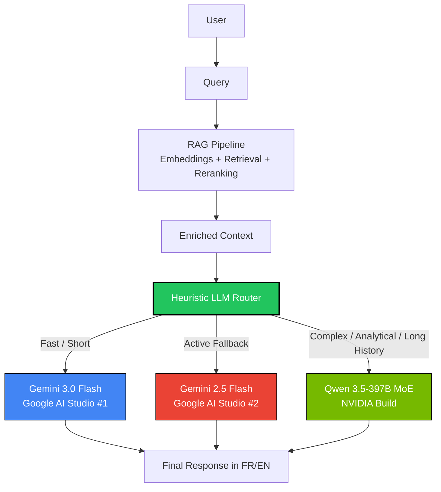

# Midolli-AI — RAG Chatbot for Data Portfolio

🇫🇷 [Version française ci-dessous](#-midolli-ai--chatbot-rag-pour-portfolio-data)

## 🇬🇧 What is Midolli-AI?

An intelligent RAG chatbot embedded in [Rafael Midolli's data portfolio](https://r-midolli.github.io/portfolio_rafael_midolli/). It answers questions about his career, CV, projects and skills in **French or English**, powered by 3 APIs with automatic fallback to guarantee zero downtime.

### 🧠 LLM Stack & Architecture (Feb 2026)

This chatbot utilizes a RAG (Retrieval-Augmented Generation) architecture coupled with an **Intelligent LLMRouter** that dynamically distributes traffic across cutting-edge 2026 LLMs, ensuring the best cost-to-performance ratio, speed, and reasoning capabilities.

#### 1. High-Speed Route (Default - 80% of queries)
Everyday profile questions are processed by Google's latest and fastest model:
- **Primary:** `gemini-3.0-flash` (via Google AI Studio Key #1)
- **Secondary (Load Balance/Fallback):** `gemini-2.5-flash` (via Google AI Studio Key #2)

#### 2. Complex Route (Heavy Reasoning - 20% of queries)
Long analytical questions, cross-project metric comparisons, or dense history (>4 interactions) trigger a heuristic bypass to a massive Mixture of Experts (MoE) model powered by a **Hyper-Dense RAG Core** (TOP_K=10 chunks).
- **Model:** `qwen3.5-397b-a17b`
- **Provider:** NVIDIA Build Ecosystem (OpenAI API Compatible)

#### 📂 Super RAG: Deep Context Ingestion
Unlike traditional RAGs (which rely on superficial summaries), `ingest.py` acts as a "spider" across local Host directories. The Vector Base is built by **directly reading the original READMEs of all 5 Workspace projects** + the original PDF CV + personal preference metadata (hobbies, routine, MBA). This ensures cross-referencing capabilities (`"In project 2 chart x returned y%, but in project 4..."`) are answered purely with injected data, eliminating hallucination.

#### 📊 LLMRouter Flowchart



### 🧪 Quality & Tests (RAG QA)

To guarantee the `Super RAG` does not experience hallucinations (e.g. inventing metrics for other projects), the repository includes an **LLM-as-a-Judge** evaluation pipeline.

1. **Ground Truth Dataset:** Cross-project questions and rigorously correct expected answers are tabulated in `tests/qa_dataset.csv`.
2. **LLM Evaluator:** The `scripts/evaluate_rag.py` script queries the RAG backend and leverages a local model as an impartial judge to verify if the generated answer is factually identical to the expected one (Score 1 to 5).
3. **Reports:** Accuracy scores and potential hallucinations are summarized in the final report at `reports/rag_evaluation_results.csv`.

**To run the accuracy test suite:**
```bash
uv run python scripts/evaluate_rag.py
```

### Quick Setup

```bash
# 1. Clone and install
git clone https://github.com/R-midolli/Midolli-AI.git
cd Midolli-AI
python -m venv .venv
.venv/Scripts/pip install -r requirements.txt   # Windows
# source .venv/bin/activate && pip install -r requirements.txt  # Linux/Mac

# 2. Configure API keys
cp .env.example .env
# Edit .env with your GEMINI_API_KEY_1, GEMINI_API_KEY_2, NVIDIA_API_KEY

# 3. Ingest knowledge base
.venv/Scripts/python backend/ingest.py

# 4. Start server
.venv/Scripts/uvicorn backend.main:app --reload --port 8000

# 5. Test
curl http://localhost:8000/health
# Open frontend/test.html in browser
```

### Portfolio Integration

Add before `</body>` in your portfolio's `index.html`:

```html
<link rel="stylesheet" href="assets/midolli-widget.css">
<script src="assets/midolli-widget.js"></script>
<script>
  document.addEventListener('DOMContentLoaded', function() {
    MidolliAI.init({
      apiUrl: 'https://YOUR-APP.onrender.com',
      lang: window.currentLang || 'fr',
      theme: document.body.dataset.theme || 'dark'
    });
  });
</script>
```

### Deploy on Render.com

1. **New → Web Service** → connect Midolli-AI GitHub repo
2. **Runtime**: Python 3.11
3. **Build command**: `pip install -r requirements.txt && python backend/ingest.py`
4. **Start command**: `uvicorn backend.main:app --host 0.0.0.0 --port $PORT`
5. **Region**: Frankfurt
6. **Environment Variables**: `GEMINI_API_KEY_1`, `GEMINI_API_KEY_2`, `NVIDIA_API_KEY`

### Tests

```bash
.venv/Scripts/pip install -r requirements-dev.txt
.venv/Scripts/pytest tests/ -v --cov=backend
```

---

## 🇫🇷 Midolli-AI — Chatbot RAG pour Portfolio Data

Un chatbot RAG intelligent intégré au [portfolio data de Rafael Midolli](https://r-midolli.github.io/portfolio_rafael_midolli/). Il répond aux questions sur son parcours, CV, projets et compétences en **français ou anglais**, avec 3 APIs en fallback automatique pour garantir zéro interruption.

### Stack Technique Principale

- **Backend** : Python 3.11, FastAPI, ChromaDB, pymupdf
- **Frontend** : Vanilla JS (IIFE), CSS isolé (`.mai-` prefix)
- **Déploiement** : Render.com (backend), GitHub Pages (widget)

### 🧠 LLM Stack & Architecture (Fév 2026)

Ce chatbot utilise une architecture RAG couplée à un **LLMRouter intelligent** qui distribue le trafic :
- **Route Rapide (80%)** : `gemini-3.0-flash` (clé #1) avec fallback sur `gemini-2.5-flash` (clé #2).
- **Route Complexe (20%)** : `qwen3.5-397b-a17b` (NVIDIA Build) déclenché heuristiquement pour les questions analytiques ou les historiques longs (TOP_K=10 chunks).

### 📂 Super RAG & Qualité (QA)
L'ingestion des données (`ingest.py`) aspire directement les READMEs originaux des 5 projets locaux du workspace + le CV PDF + les profils personnels pour éviter les hallucinations.
Le repo inclut également un pipeline automatisé **LLM-as-a-Judge** (`evaluate_rag.py`) testant l'exactitude factuelle en croisant les projets (Score 1-5).

### Fonctionnalités Clés

- ✅ Réponses FR/EN avec détection automatique de langue
- ✅ Thème dark/light synchronisé avec le portfolio
- ✅ 3-API fallback : Google AI #1 → Google AI #2 → NVIDIA
- ✅ Base de connaissances : READMEs de projets originaux + CV PDF + Profils
- ✅ Mobile responsive (375px+) et SVG logo au format standard

---

**Author / Auteur** : Rafael Midolli — [LinkedIn](https://linkedin.com/in/rafael-midolli) — [Portfolio](https://r-midolli.github.io/portfolio_rafael_midolli/)
