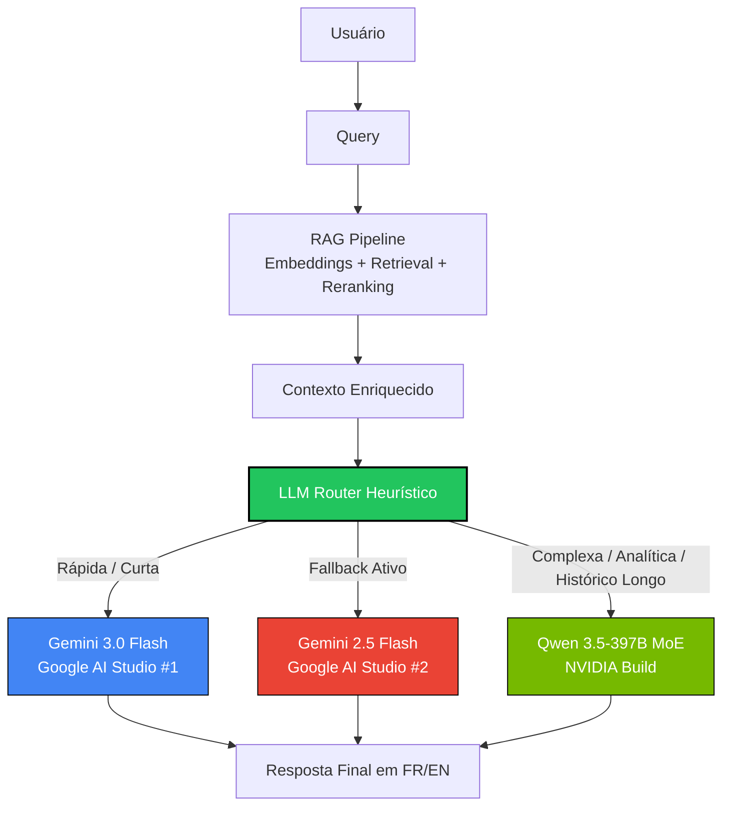

# Midolli-AI — RAG Chatbot for Data Portfolio

🇫🇷 [Version française ci-dessous](#-midolli-ai--chatbot-rag-pour-portfolio-data)

## 🇬🇧 What is Midolli-AI?

An intelligent RAG chatbot embedded in [Rafael Midolli's data portfolio](https://r-midolli.github.io/portfolio_rafael_midolli/). It answers questions about his career, CV, projects and skills in **French or English**, powered by 3 APIs with automatic fallback to guarantee zero downtime.

### 🧠 LLM Stack & Arquitetura (Fev 2026)

Este chatbot utiliza a arquitetura RAG (Retrieval-Augmented Generation) acoplada a um **LLMRouter Inteligente** que distribui dinamicamente o tráfego entre diferentes LLMs de ponta da geração 2026, garantindo o melhor custo-benefício, velocidade e capacidade de raciocínio.

#### 1. Rota de Alta Velocidade (Padrão - 80% das queries)
As perguntas do dia a dia sobre o perfil são processadas pela versão mais recente e rápida da Google:
- **Primário:** `gemini-3.0-flash` (via Google AI Studio Key #1)
- **Secundário (Load Balance/Fallback):** `gemini-2.5-flash` (via Google AI Studio Key #2)

#### 2. Rota Complexa (Raciocínio Pesado - 20% das queries)
Perguntas analíticas longas, comparações de métricas entre projetos ou históricos densos (>4 interações) sofrem bypass heurístico para um modelo gigantesco Mixture of Experts (MoE), alimentado por um **Coração RAG Hiper-Denso** (TOP_K=10 chunks).
- **Modelo:** `qwen3.5-397b-a17b`
- **Provedor:** NVIDIA Build Ecosystem (OpenAI API Compatible)

#### 📂 Super RAG: Ingestão de Contexto Profundo
Diferente de RAGs tradicionais (que se limitam a resumos superficiais), o `ingest.py` foi arquitetado para fazer "spidering" nos diretórios locais do Host. A Base Vetorial é gerada a partir da **leitura direta dos READMEs originais dos 5 projetos no Workspace** + o arquivo CV PDF original + metadados de preferências pessoais (hobbies, rotina, MBA). Isso garante que ferramentas cruzadas e métricas (`"No projeto 2 o gráfico x retornou y%, mas no projeto 4..."`) sejam respondidas puramente com os dados injetados, eliminando alucinação.

#### 📊 Fluxograma do LLMRouter



### 🧪 Qualidade & Testes (QA RAG)

Para garantir que o `Super RAG` não gere alucinações (ex: inventando métricas de outros projetos), o repositório conta com um pipeline de avaliação **LLM-as-a-Judge**.

1. **Dataset Ground Truth:** As perguntas cruzadas e as respostas corretas e rigorosas estão tabuladas em `tests/qa_dataset.csv`.
2. **LLM Evaluator:** O script `scripts/evaluate_rag.py` dispara as perguntas contra o backend do RAG e utiliza o modelo local como um juiz imparcial para conferir se a resposta gerada é factualmente idêntica à esperada (Score 1 a 5).
3. **Relatórios:** Os resultados da acurácia e delírios caem no relatório final em `reports/rag_evaluation_results.csv`.

**Para rodar a bateria de testes de acurácia:**
```bash
uv run python scripts/evaluate_rag.py
```

### Quick Setup

```bash
# 1. Clone and install
git clone https://github.com/R-midolli/Midolli-AI.git
cd Midolli-AI
python -m venv .venv
.venv/Scripts/pip install -r requirements.txt   # Windows
# source .venv/bin/activate && pip install -r requirements.txt  # Linux/Mac

# 2. Configure API keys
cp .env.example .env
# Edit .env with your GEMINI_API_KEY_1, GEMINI_API_KEY_2, NVIDIA_API_KEY

# 3. Ingest knowledge base
.venv/Scripts/python backend/ingest.py

# 4. Start server
.venv/Scripts/uvicorn backend.main:app --reload --port 8000

# 5. Test
curl http://localhost:8000/health
# Open frontend/test.html in browser
```

### Portfolio Integration

Add before `</body>` in your portfolio's `index.html`:

```html
<link rel="stylesheet" href="assets/midolli-widget.css">
<script src="assets/midolli-widget.js"></script>
<script>
  document.addEventListener('DOMContentLoaded', function() {
    MidolliAI.init({
      apiUrl: 'https://YOUR-APP.onrender.com',
      lang: window.currentLang || 'fr',
      theme: document.body.dataset.theme || 'dark'
    });
  });
</script>
```

### Deploy on Render.com

1. **New → Web Service** → connect Midolli-AI GitHub repo
2. **Runtime**: Python 3.11
3. **Build command**: `pip install -r requirements.txt && python backend/ingest.py`
4. **Start command**: `uvicorn backend.main:app --host 0.0.0.0 --port $PORT`
5. **Region**: Frankfurt
6. **Environment Variables**: `GEMINI_API_KEY_1`, `GEMINI_API_KEY_2`, `NVIDIA_API_KEY`

### Tests

```bash
.venv/Scripts/pip install -r requirements-dev.txt
.venv/Scripts/pytest tests/ -v --cov=backend
```

---

## 🇫🇷 Midolli-AI — Chatbot RAG pour Portfolio Data

Un chatbot RAG intelligent intégré au [portfolio data de Rafael Midolli](https://r-midolli.github.io/portfolio_rafael_midolli/). Il répond aux questions sur son parcours, CV, projets et compétences en **français ou anglais**, avec 3 APIs en fallback automatique pour garantir zéro interruption.

### Stack Technique

- **Backend** : FastAPI, ChromaDB, pymupdf
- **LLMs** : Gemini 1.5 Flash (×2 clés), NVIDIA LLaMA-3.1-70B (fallback)
- **Embedding** : Gemini gemini-embedding-001 (3072 dimensions)
- **Frontend** : Vanilla JS (IIFE), CSS isolé (`.mai-` prefix)
- **Déploiement** : Render.com (backend), GitHub Pages (widget)

### Fonctionnalités

- ✅ Réponses FR/EN avec détection automatique de langue
- ✅ Thème dark/light synchronisé avec le portfolio
- ✅ Toggle FR/EN synchronisé en temps réel
- ✅ 3-API fallback : Gemini KEY_1 → KEY_2 → NVIDIA
- ✅ Base de connaissances : 13 fichiers MD + CV PDF
- ✅ Zero invention : le bot ne répond que depuis le contexte vérifié
- ✅ Mobile responsive (375px+)
- ✅ Logo SVG inline (M + AI, gradient violet)

---

**Author / Auteur** : Rafael Midolli — [LinkedIn](https://linkedin.com/in/rafael-midolli) — [Portfolio](https://r-midolli.github.io/portfolio_rafael_midolli/)
